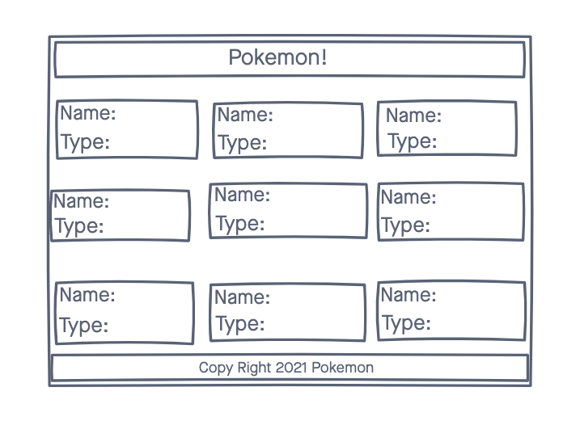

# Pokemon Ajax Project 
A web app that lets you veiw some of your favorite pokemon! 

## Technologies 
- HTML5
- JavaScript
- jQuery
- CSS3
- PokeApi

## Wireframes/Screenshots

## Getting started 
[Click Away](https://roccowhiting.github.io/pokemon-ajax-project/) to get started

## Future Enhancements

- Adding a background image to the card class and the body tag 
- adding a modal to the card class bringing up an image and name of the pokemon by clicking the pokeball 
